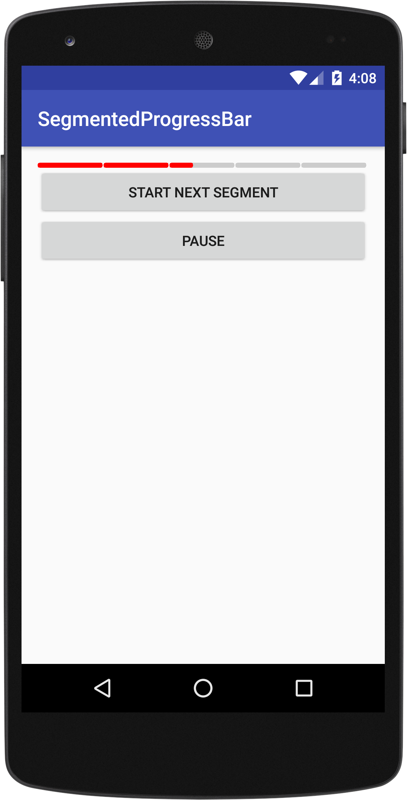

# SegmentedProgressBar
Instagram like segmented progress bar for Android.

Screenshots
-------------------



How does it work?
-------------------

Just add the dependency to your build.gradle:

```gradle
allprojects {
  repositories {
    ...
    maven { url 'https://jitpack.io' }
  }
}
```

```gradle
dependencies {
        compile 'com.github.carlosmuvi:SegmentedProgressBar:0.8.3'
}

```
Next, add it to your layout

```xml
  <com.carlosmuvi.segmentedprogressbar.SegmentedProgressBar
      android:id="@+id/segmented_progressbar"
      android:layout_width="match_parent"
      android:layout_height="5dp"/>
```

Usage and customization
-------------------

**Programatically**

```java
segmentedProgressBar = (SegmentedProgressBar) findViewById(R.id.segmented_progressbar);

// number of segments in your bar
segmentedProgressBar.setSegmentCount(7); 

//empty segment color
segmentedProgressBar.setContainerColor(Color.BLUE); 
//fill segment color
segmentedProgressBar.setFillColor(Color.GREEN); 

//play next segment specifying its duration
segmentedProgressBar.playSegment(5000);

//pause segment
segmentedProgressBar.pause();

//reset
segmentedProgressBar.reset();

//set filled segments directly
segmentedProgressBar.setCompletedSegments(3);

//fill the next empty segment without animation
segmentedProgressBar.incrementCompletedSegments();
```

**In your layout**

```xml
  <com.carlosmuvi.segmentedprogressbar.SegmentedProgressBar
      android:id="@+id/segmented_progressbar"
      android:layout_width="match_parent"
      android:layout_height="5dp"
      app:container_color="@color/colorAccent"
      app:fill_color="@color/colorPrimary"
      app:gap_size="@dimen/progressbar_gap"
      app:segment_count="3"
      />
```


License
-------

    Copyright 2015 Carlos Munoz

    Licensed under the Apache License, Version 2.0 (the "License");
    you may not use this file except in compliance with the License.
    You may obtain a copy of the License at

       http://www.apache.org/licenses/LICENSE-2.0

    Unless required by applicable law or agreed to in writing, software
    distributed under the License is distributed on an "AS IS" BASIS,
    WITHOUT WARRANTIES OR CONDITIONS OF ANY KIND, either express or implied.
    See the License for the specific language governing permissions and
    limitations under the License.
